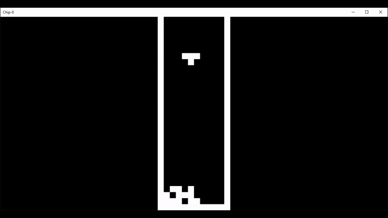

<a id="readme-top"></a>

<!-- PROJECT LOGO -->
<br />
<div align="center">
  <a href="https://github.com/QuinnJohnsonCode/chip-emu">
    
  </a>

<h3 align="center">chip-emu</h3>

  <p align="center">
    A CHIP-8 interpreter written for modern systems in C++.
  </p>
</div>


<!-- TABLE OF CONTENTS -->
<details>
  <summary>Table of Contents</summary>
  <ol>
    <li>
      <a href="#about-the-project">About The Project</a>
      <ul>
        <li><a href="#built-with">Built With</a></li>
      </ul>
    </li>
    <li>
      <a href="#getting-started">Getting Started</a>
      <ul>
        <li><a href="#prerequisites">Prerequisites</a></li>
        <li><a href="#installation">Installation</a></li>
      </ul>
    </li>
    <li><a href="#usage">Usage</a></li>
    <li><a href="#roadmap">Roadmap</a></li>
    <li><a href="#license">License</a></li>
    <li><a href="#contact">Contact</a></li>
    <li><a href="#acknowledgments">Acknowledgments</a></li>
  </ol>
</details>


<!-- ABOUT THE PROJECT -->
## About The Project

chip-emu is a simple and lightweight CHIP-8 emulator written in C++ using SDL2 for graphics. It provides a straightforward way to run CHIP-8 programs on modern systems.


### Built With

* [](https://isocpp.org/)
* [][SDL-url]
* [](https://www.gnu.org/software/make/)


<!-- GETTING STARTED -->
## Getting Started

Follow these instructions to set up the emulator and start running CHIP-8 programs.

### Prerequisites

Make sure you have the following installed:

* GCC (GNU Compiler Collection)
  ```sh
  sudo apt install gcc
  ```
* Make
  ```sh
  sudo apt install make
  ```
* SDL2
  ```sh
  sudo apt install libsdl2-dev
  ```

### Installation

1. Clone the repository
   ```sh
   git clone https://github.com/QuinnJohnsonCode/chip-emu.git
   ```
2. Navigate to the project directory
   ```sh
   cd chip-emu/src/
   ```
3. Compile the project
   ```sh
   make
   ```


<!-- USAGE EXAMPLES -->
## Usage

To run the emulator, use the following command:
```sh
./main.out <number_of_cycles_per_frame> <rom_path>
```

Example:
```sh
./main.out 10 roms/TETRIS.ch8
```

<!-- ROADMAP -->
## Roadmap

- [x] Implement all 36 OPCODES
- [x] Add keypad support
- [x] Add debugging features
- [ ] Implement sound support
- [ ] Support more CHIP-8 variations

See the [open issues](https://github.com/QuinnJohnsonCode/chip-emu/issues) for a full list of proposed features and known issues.

<!-- LICENSE -->
## License

Distributed under the MIT License. See `LICENSE.txt` for more information.


<!-- CONTACT -->
## Contact

Quinn Johnson - [GitHub](https://github.com/QuinnJohnsonCode)

Project Link: [https://github.com/QuinnJohnsonCode/chip-emu](https://github.com/QuinnJohnsonCode/chip-emu)


<!-- ACKNOWLEDGMENTS -->
## Acknowledgments

* [Cowgod's CHIP-8 Technical Reference](http://devernay.free.fr/hacks/chip8/C8TECH10.HTM)
* [High-level Guide to CHIP-8](https://tobiasvl.github.io/blog/write-a-chip-8-emulator/)
* [SDL2 Documentation](https://wiki.libsdl.org/)


<!-- MARKDOWN LINKS & IMAGES -->
[SDL-url]: https://www.libsdl.org/

